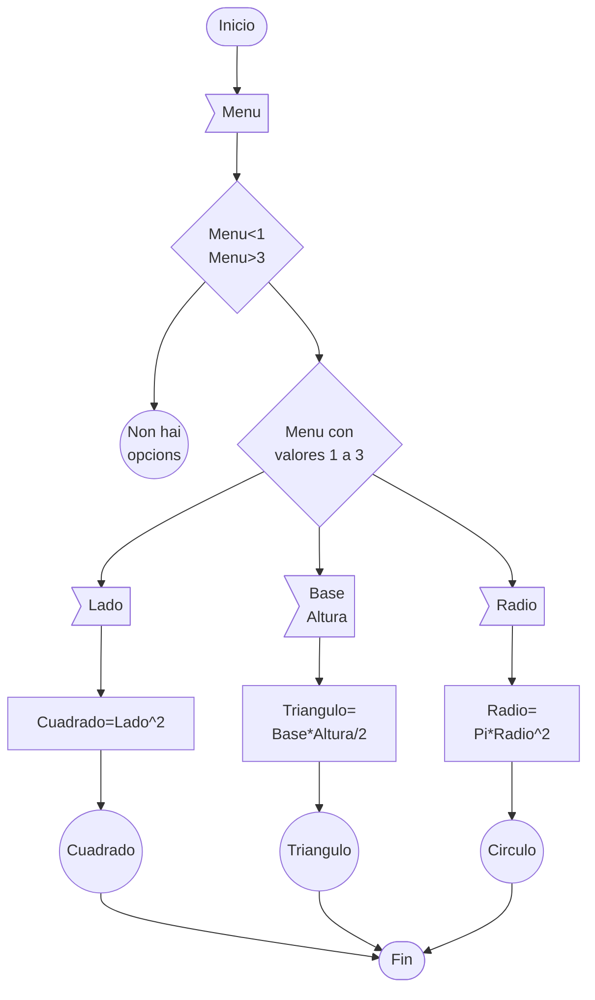

# examenDAM
Para utilizarlo en el examen

## Como clonar un repositorio:

Para clonar un repositorio lo primero que necesitamos es la dirección de ese repositorio en cuestión. Una vez tengamos la dirección del repositorio procedemos a clonarlo mediante el comando 'git clone (direccionrepositorio)'. Este comando nos clonara todo el contenido que tenga el repositorio en nuestro equipo. 

## Como hacer un commit de un proyecto:

Para subir un proyecto a github lo primero que tenemos que hacer es meter el proyecto en la carpeta donde tenemos iniciado el repositorio. Una vez tengamos todo lo que queremos subir a github utilizamos los siguientes comandos:
git add . Este comando añade todo lo que se encuentra en la carpeta del repositorio.
git commit -m "texto" Este comando hace un commit de lo añadido anteriormente.
git push Este sube todo el contenido del commit a github

Para cambiarle el nombre a un commit anteriormente tenemos que utilizar el comando: git-blame-someone-else <autor> <versioncommit>

## Diagrama de flujo:

Para crear un diagrama de flujo se puede de distintas formas en este caso esta realizado con la herramienta mermaid. Esta herramienta nos hace un diagrama a partir del codigo de nuestro proyecto.

## Diagrama de flujo:

## Creación de etiquetas:

Para crear una etiqueta tenemos que utilizar el siguiente comando:
git tag -a v1.0 -m 'Mi primera etiqueta'
Con este comando pordremos crear diferentes etiquetas. Podemos ver todas estas etiquetas con el comando git tag
Para hacer el push de una etiqueta tenemos que hacer:
git push origin v1.0

## Creación de un .jar desde intellij

Lo primero que tenemos que hacer es crear un proyecto nuevo, posteriromente cuando el proyecto este acabado entramos en la configuración del proyecto y seleccionamos la opcion de artifacts.
Una vez seleccionado esta opcion presionamos en el simbolo de + y añadimos yn JAR. Una vez finalizado este proceso seleccionamos la opcion de build y creamos el .jar
Este .jar lo podemos encontrar el la carpeta del proyecto dentro de las carpetas de out y de proyecto.
Para ejecutar este .jar se uede hacer de dos maneras una es haciendo doble click encima del .jar o desde la consola mediante el comando java -jar

## Crear release:

Para crear una release en github Lo unico que necesitamos es un .jar y tener una etiqueta ya creada y subida a nuestro repositorio de github.
Una vez tengamos todo esto seleccionamos la opción de release dentro de nuetro repositorio y seleccionamos una etiqueta y subimos el .jar 

